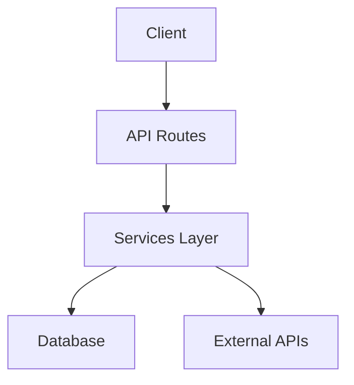
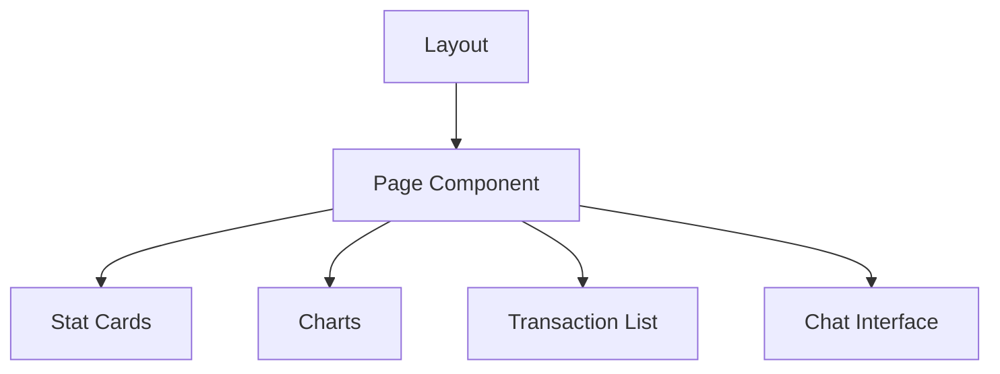

# Xspensy Development Notes

## Completed Features

1. Core Services
- ✅ Financial Service with transaction management
- ✅ Config Service with environment handling
- ✅ Chat Service with AI integration
- ✅ API Client utility

2. API Routes
- ✅ Transactions API (`/api/transactions`)
- ✅ Chat API (`/api/chat`)

3. Components
- ✅ Dashboard layout
- ✅ Stat cards
- ✅ Transaction list
- ✅ Chat interface

4. Styling
- ✅ Tailwind configuration
- ✅ Component-specific styles
- ✅ Responsive layout

## Pending Tasks

1. Database Integration
- [ ] Set up Prisma
- [ ] Create database schema
- [ ] Implement data migrations
- [ ] Add data persistence

2. Authentication
- [ ] User authentication system
- [ ] Protected routes
- [ ] API route protection
- [ ] Session management

3. Features
- [ ] Charts and visualizations
- [ ] Transaction categories
- [ ] Financial reports
- [ ] Budget planning
- [ ] Export functionality

4. Testing
- [ ] Unit tests for services
- [ ] API route tests
- [ ] Component tests
- [ ] E2E testing

5. Deployment
- [ ] Environment configuration
- [ ] Production build optimization
- [ ] CI/CD setup
- [ ] Monitoring and logging

## Next Steps

1. Database Implementation
```bash
# Install Prisma
npm install @prisma/client prisma
npx prisma init

# Create schema
npx prisma generate
npx prisma db push
```

2. Authentication Setup
- Research auth providers
- Implement auth middleware
- Add protected routes

3. Testing Infrastructure
```bash
# Install testing dependencies
npm install -D jest @testing-library/react @testing-library/jest-dom
```

## Architecture Notes

### Data Flow


### Component Structure


## Environment Variables

Required variables for production:
```env
DATABASE_URL=
DEEPSEEK_API_KEY=
NEXTAUTH_SECRET=
NEXTAUTH_URL=
```

## Performance Considerations

1. Data Fetching
- Implement caching
- Use incremental static regeneration
- Optimize API responses

2. Bundle Size
- Code splitting
- Dynamic imports
- Tree shaking

3. State Management
- Consider Redux for complex state
- Use React Query for server state

## Security Notes

1. API Security
- Rate limiting
- Input validation
- CORS configuration

2. Data Protection
- Encryption at rest
- Secure session handling
- API key rotation

## Maintenance Guidelines

1. Code Style
- Follow ESLint rules
- Use TypeScript strictly
- Document complex logic

2. Testing
- Write tests for new features
- Maintain 80%+ coverage
- Test error scenarios

3. Deployment
- Use staging environment
- Implement feature flags
- Monitor error rates